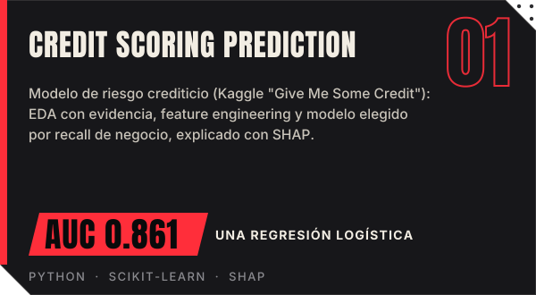
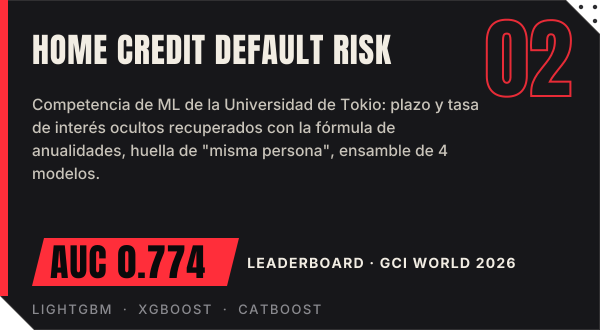
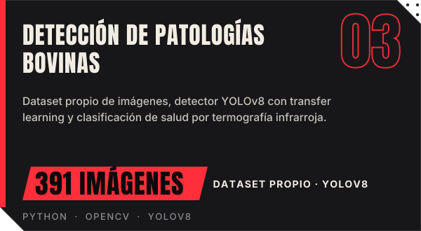
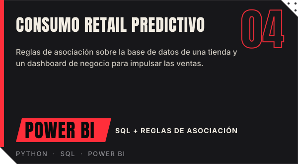
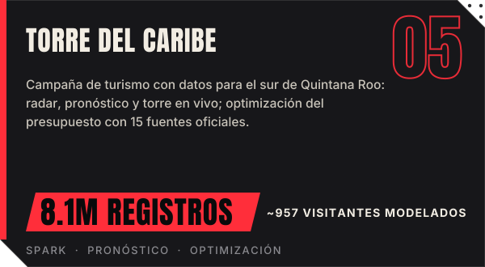
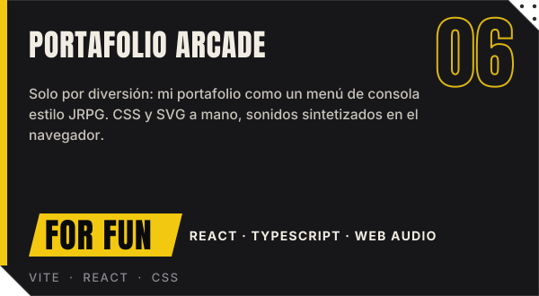

<a href="README.md">🇺🇸 English</a> · <b>🇲🇽 Español</b>

&nbsp;&nbsp;&nbsp;

**Convierto datos de negocio en modelos de machine learning y automatizaciones que ayudan a tomar decisiones**, con foco en finanzas y riesgo crediticio.

- 🧠 Participé en la competencia de ML de **GCI World 2026**, el programa de ciencia de datos del **Matsuo-Iwasawa Lab, The University of Tokyo**: ROC-AUC **0.774** en el leaderboard público
- ⚡ **−30% en tiempo de procesamiento** al rediseñar la estructura de la base de datos y las consultas SQL en MAXI
- 📈 **+10% en ventas** usando el análisis de ventas históricas para decidir el reabastecimiento
- 💼 **Becario de Desarrollo y Automatización en HSBC GSC** desde mayo 2026 · 🎓 Lic. en Ciencias de Datos para Negocios, UNRC (2024 – 2028) · 🌱 mentoría con **Inroads**

| Proyecto | Qué es | Enlaces |
|---|---|---|
| 🌴 **Torre del Caribe** | Proyecto en equipo (responsable técnico): campaña de turismo con datos para el sur de Quintana Roo, 8.1M registros de 15 fuentes oficiales | [Sitio en línea](https://catoxp.github.io/torre-del-caribe-unrc-2026/) · [Repo](https://github.com/CatoXP/torre-del-caribe-unrc-2026) |
| 🏥 **Sistema de Citas — Centro de Salud** | Reserva de citas médicas en línea con validación y confirmación para el Centro de Salud Rafael Carrillo | [Sitio en línea](https://catoxp.github.io/centro-de-salud-rafael-carrillo-sistema-citas/) · [Repo](https://github.com/CatoXP/centro-de-salud-rafael-carrillo-sistema-citas) |
| 🎓 **Deserción Escolar (EDA)** | Análisis de la tasa de abandono escolar en México y en la UNRC, con SQL y puntaje de riesgo | [Repo](https://github.com/CatoXP/desercion-escolar-eda) |
| 💊 **Proyección de Medicamentos — Iztapalapa** | Proyección del consumo de medicamentos y simulación de control de calidad en lotes | [Repo](https://github.com/CatoXP/Simulacion-y-Proyeccion-de-Medicamentos-en-Iztapalapa-usando-Ciencia-de-Datos) |
| 📁 **Portafolio completo** | Todos mis proyectos de ciencia de datos, organizados por tipo | [Repo](https://github.com/CatoXP/portfolio-data-science) |

No es un proyecto serio: mi portafolio convertido en un menú de consola estilo JRPG, solo porque sí. <a href="https://catoxp.github.io/portafolio-datascience-arcade/">Presiona start ▶</a>

**Becario de Desarrollo y Automatización — HSBC GSC** · *mayo 2026 – actual*
Automatización de procesos operativos con Python, VBA y Excel; macros para consolidar información; aplicación de escritorio en Python (interfaz gráfica) para gestionar procesos internos.

**Database Manager — MAXI** · *sep 2022 – oct 2024*
Optimización de la estructura y de las consultas SQL (**−30% de tiempo de procesamiento**); administración de un ERP interno; análisis de ventas históricas para decidir el reabastecimiento (**+10% en ventas**).

 

 

<b>🤖 Inteligencia Artificial y Machine Learning</b>

 

- Microsoft Azure AI Essentials — Microsoft (2026)
- Artificial Intelligence Fundamentals — IBM SkillsBuild (2026)
- Introducción a la IA moderna — Cisco Networking Academy (2026)
- Introduction to Generative AI — Google Cloud (2026)
- Build AI Apps with ChatGPT, Dall-E y GPT-4 — Scrimba (2026)
- Inteligencia Artificial generativa en finanzas y contabilidad — LinkedIn Learning (2026)

<b>📊 Datos, Big Data y Analítica</b>

 

- Hadoop Foundations – Level 1 — IBM (2026)
- Big Data Foundations – Level 1 — IBM (2026)
- Data Analytics Essentials — Cisco Networking Academy (2025)
- Métodos estadísticos en data analytics — Accenture (2026)
- Google Data Analytics: *Foundations*, *Ask Questions to Make Data-Driven Decisions*, *Prepare Data for Exploration* — Google (2026)
- Google Analytics (en curso) — Google (2026)
- Introducción a Ciencia de Datos — Santander Open Academy (2025)
- Analista de Datos — DS4B (2024)

<b>💰 Finanzas y Negocio</b>

 

- Análisis financiero con Power BI — LinkedIn Learning (2026)
- Finanzas: Tecnología e Inteligencia Artificial — LinkedIn Learning (2026)
- Fundamentos de Fintech — LinkedIn Learning (2026)
- SQL Intermedio — Accenture (2026)

<b>🐍 Programación</b>

 

- Python Essentials 1 & 2 — Cisco / Python Institute (2025)
- Python para Ciencia de Datos — A2 Aprende y Aplica Capacitación (2025)
- Excel avanzado: Automatizaciones con VBA — LinkedIn Learning (2026)

 

Siempre con gusto de platicar sobre <b>ciencia de datos, analítica y machine learning</b>, sobre todo en finanzas y riesgo crediticio.  

Identidad visual compartida con mi <a href="https://catoxp.github.io/portafolio-datascience-arcade/">portafolio arcade</a>: void · blood · bone. Tipografías: Anton e Inter (SIL OFL).

