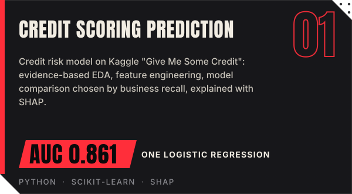
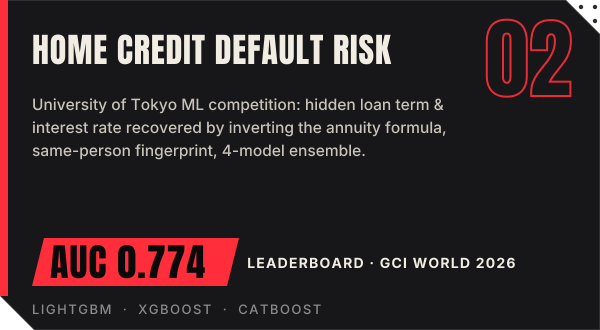
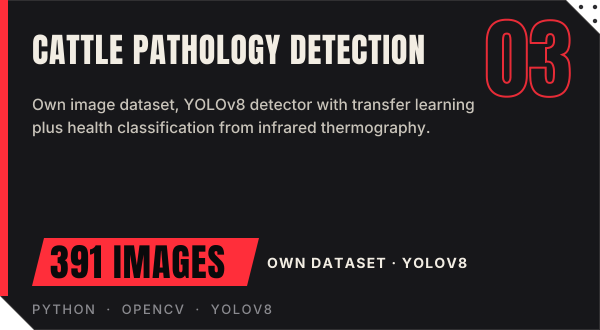
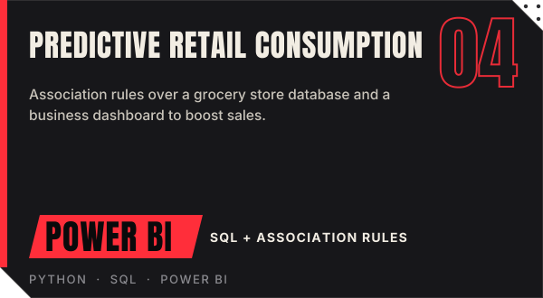
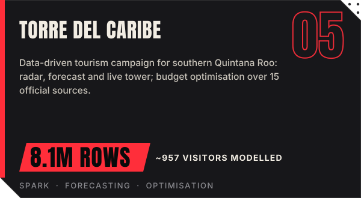
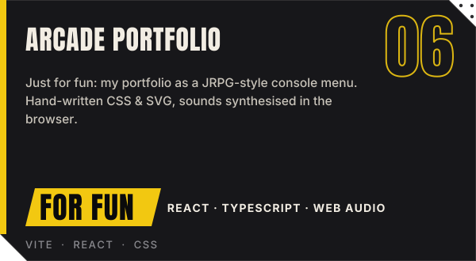

<b>🇺🇸 English</b> · <a href="README.es.md">🇲🇽 Español</a>

&nbsp;&nbsp;&nbsp;

**I turn business data into machine learning models and automations that drive decisions** — with a focus on finance and credit risk.

- 🥇 **Top 16** in the ML competition of **GCI World 2026**, the data science program of the **Matsuo-Iwasawa Lab, The University of Tokyo** (ROC-AUC 0.774)
- ⚡ **−30% processing time** after redesigning database structure and SQL queries at MAXI
- 📈 **+10% sales** using historical sales analysis to drive restocking decisions
- 💼 **Development & Automation Intern at HSBC GSC** since May 2026 · 🎓 B.Sc. Data Science for Business, UNRC (2024 – 2028) · 🌱 mentored by **Inroads**

| Project | What it is | Links |
|---|---|---|
| 🌴 **Torre del Caribe** | Team project (technical lead): data-driven tourism campaign for southern Quintana Roo, 8.1M rows from 15 official sources | [Live site](https://catoxp.github.io/torre-del-caribe-unrc-2026/) · [Repo](https://github.com/CatoXP/torre-del-caribe-unrc-2026) |
| 🏥 **Health Centre Appointment System** | Online appointment booking with validation and confirmation for Centro de Salud Rafael Carrillo | [Live site](https://catoxp.github.io/centro-de-salud-rafael-carrillo-sistema-citas/) · [Repo](https://github.com/CatoXP/centro-de-salud-rafael-carrillo-sistema-citas) |
| 🎓 **School Dropout EDA** | Dropout-rate analysis for Mexico and UNRC with SQL and risk scoring | [Repo](https://github.com/CatoXP/desercion-escolar-eda) |
| 💊 **Medication Projection — Iztapalapa** | Medication-consumption projection and quality-control simulation | [Repo](https://github.com/CatoXP/Simulacion-y-Proyeccion-de-Medicamentos-en-Iztapalapa-usando-Ciencia-de-Datos) |
| 📁 **Full portfolio** | All my data science projects, organised by type | [Repo](https://github.com/CatoXP/portfolio-data-science) |

Not a serious project — my portfolio reimagined as a JRPG console menu, just because. <a href="https://catoxp.github.io/portafolio-datascience-arcade/">Press start ▶</a>

**Development & Automation Intern — HSBC GSC** · *May 2026 – present*
Automation of operational processes with Python, VBA and Excel; macros to consolidate information; a Python desktop app (GUI) to manage internal processes.

**Database Manager — MAXI** · *Sep 2022 – Oct 2024*
Database structure and SQL query optimisation (**−30% processing time**); administration of an internal ERP; historical sales analysis for restocking decisions (**+10% sales**).

 

 

<b>🤖 AI & Machine Learning</b>

 

- Microsoft Azure AI Essentials — Microsoft (2026)
- Artificial Intelligence Fundamentals — IBM SkillsBuild (2026)
- Introducción a la IA moderna — Cisco Networking Academy (2026)
- Introduction to Generative AI — Google Cloud (2026)
- Build AI Apps with ChatGPT, Dall-E and GPT-4 — Scrimba (2026)
- Inteligencia Artificial generativa en finanzas y contabilidad — LinkedIn Learning (2026)

<b>📊 Data, Big Data & Analytics</b>

 

- Hadoop Foundations – Level 1 — IBM (2026)
- Big Data Foundations – Level 1 — IBM (2026)
- Data Analytics Essentials — Cisco Networking Academy (2025)
- Métodos estadísticos en data analytics — Accenture (2026)
- Google Data Analytics: *Foundations*, *Ask Questions to Make Data-Driven Decisions*, *Prepare Data for Exploration* — Google (2026)
- Google Analytics (in progress) — Google (2026)
- Introducción a Ciencia de Datos — Santander Open Academy (2025)
- Analista de Datos — DS4B (2024)

<b>💰 Finance & Business</b>

 

- Análisis financiero con Power BI — LinkedIn Learning (2026)
- Finanzas: Tecnología e Inteligencia Artificial — LinkedIn Learning (2026)
- Fundamentos de Fintech — LinkedIn Learning (2026)
- SQL Intermedio — Accenture (2026)

<b>🐍 Programming</b>

 

- Python Essentials 1 & 2 — Cisco / Python Institute (2025)
- Python para Ciencia de Datos — A2 Aprende y Aplica Capacitación (2025)
- Excel avanzado: Automatizaciones con VBA — LinkedIn Learning (2026)

 

Always happy to talk about <b>data science, analytics and machine learning</b> — especially in finance and credit risk.  

Visual identity shared with my <a href="https://catoxp.github.io/portafolio-datascience-arcade/">arcade portfolio</a>: void · blood · bone. Fonts: Anton & Inter (SIL OFL).

